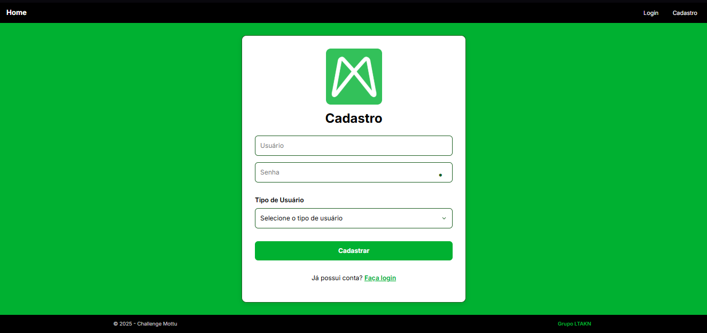
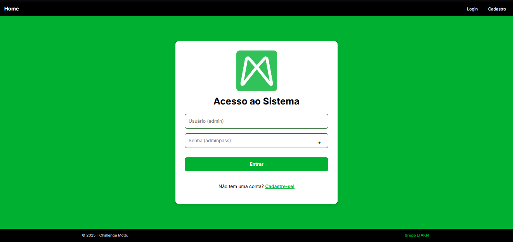
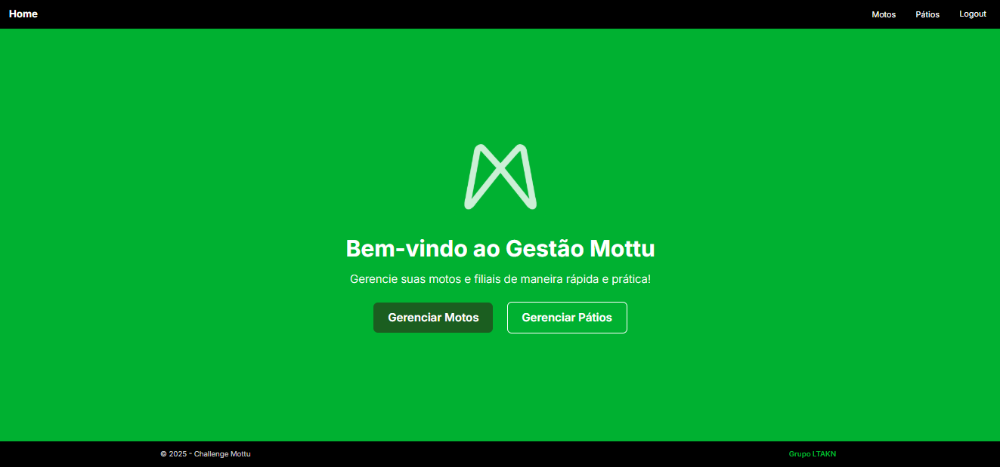
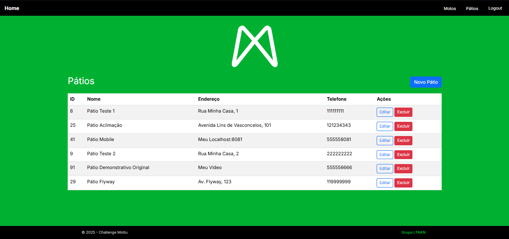
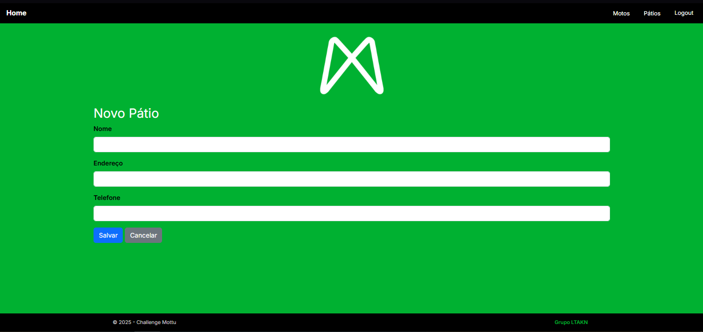
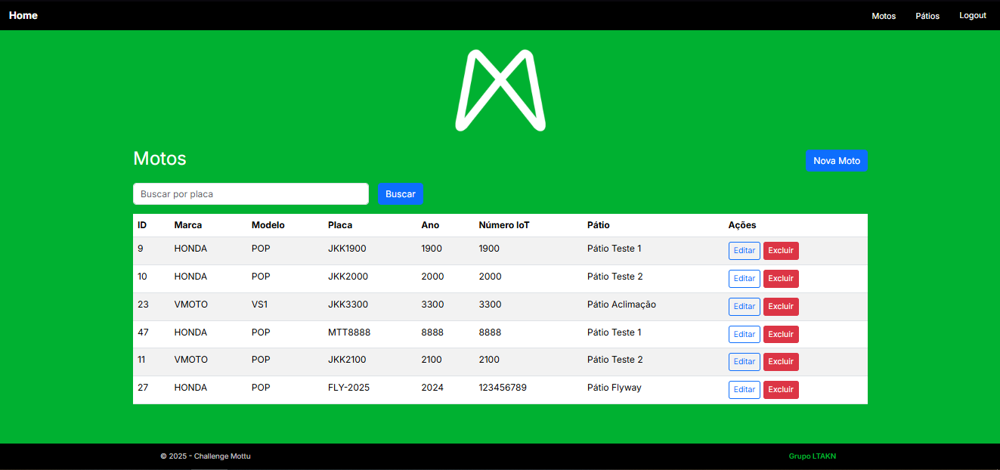
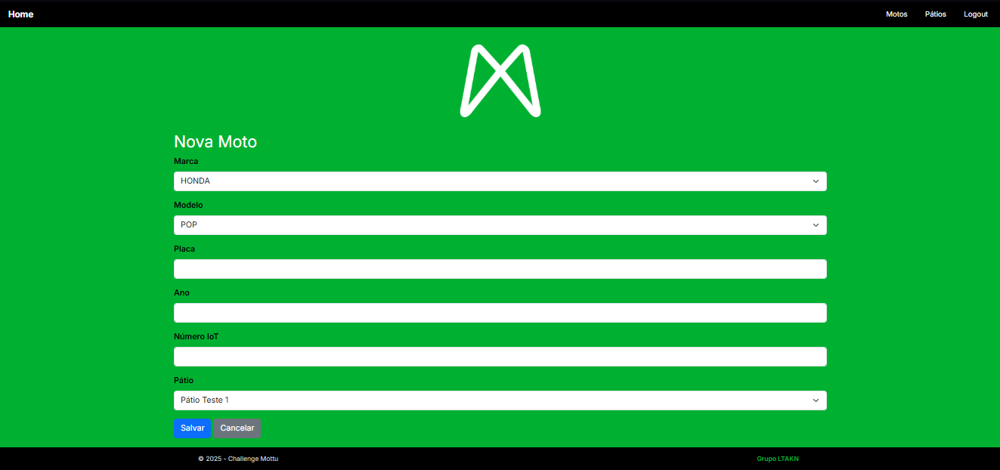
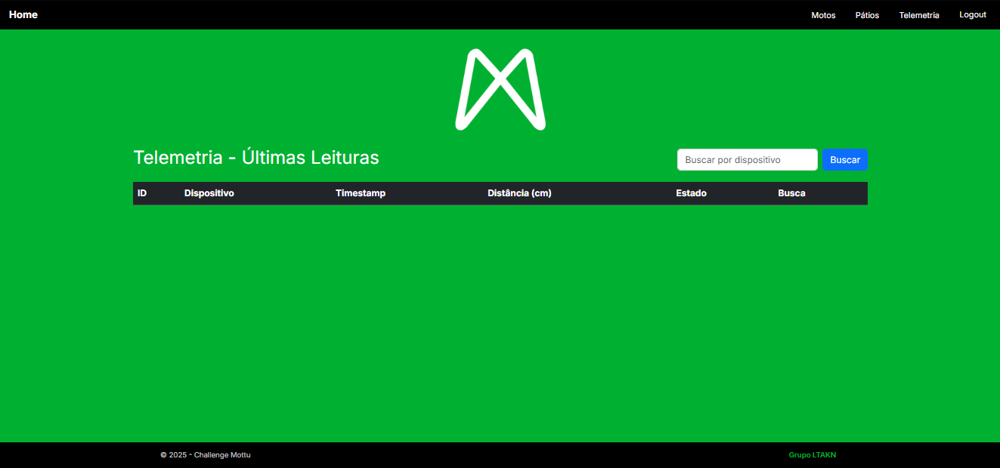

## 📽️ Vídeo de demonstração

### [Link do vídeo]()

---

# Gestão de Frota - Challenge Java 2025 Sprint 4

**Grupo:** LTAKN

* Enzo Prado Soddano — RM557937
* Lucas Resende Lima — RM556564
* Vinícius Prates Altafini — RM559183

---

## 📌 Descrição

Este projeto contém a terceira sprint do **Challenge 2025** da disciplina de Java Advanced.
Ele consiste em uma aplicação de **Gestão de Frota** que permite cadastrar, listar, atualizar e deletar motos, pátios e usuários através de interface web, além de fornecer endpoints REST.

O projeto utiliza:

* Interface web com **Spring MVC + Thymeleaf**
* CRUD completo de Motos, Pátios e Usuários
* Segurança com **Spring Security**
* Persistência com **Spring Data JPA** e **Azure SQL Server**
* Migrations automatizadas com **Flyway**
* Estilização com Bootstrap + CSS customizado

---

## 🛠️ Tecnologias

* **Java 17**
* **Spring Boot 3**
* **Spring MVC + Thymeleaf**
* **Spring Data JPA**
* **Spring Security**
* **Flyway**
* **Maven**
* **Azure SQL Server**
* **Bootstrap + CSS customizado**
* **Lombok**

---

## ⚙️ Como rodar localmente

1. Clone o repositório:
   ```
   git clone https://github.com/DerBrasilianer/Challenge_Java_2025_Sprint4.git
   cd Challenge_Java_2025_Sprint4
   ```

2. Abra o projeto no **IntelliJ** (ou outra IDE compatível com Java 21).

3. Configure o banco Oracle no `application.properties` com usuário, senha e URL corretos.

4. Rode a aplicação a partir da classe principal:
   ""
   com.fiap.gestaofrota.GestaoFrotaApplication
   ""

5. A aplicação ficará disponível em:
   [http://localhost:8080](http://localhost:8080)

---

## 🛠️ Usuários para Teste

* **user, userpass (usuário padrão)**
* **admin, adminpass (usuário administrador)**

---

## 👀 Funcionalidades

* **CRUD de Motos:**

    * Criar, listar, editar e deletar motos
    * Cada moto está associada a um Pátio

* **CRUD de Pátios:**

    * Criar, listar, editar e deletar pátios
    * Um pátio pode ter várias motos

* **Conferência de Telemetria:**

    * Conferir dados de telemetria enviads pelo IoT

* **CRUD de Usuários:**

    * Registro de novos usuários
    * Login e logout
    * Validação de username único

* **Interface web:**

    * Templates Thymeleaf estilizados com Bootstrap e CSS
    * Barra de navegação com login/logout

* **API REST:**

    * Endpoints para Motos (`/api/motos`)
    * Endpoints para Pátios (`/api/patios`)
    * Endpoints para Telemetria (`/telemetria`)
    * Endpoints para Usuários via registro/login

* **Segurança:**

    * Login e registro de usuários
    * Logout seguro
    * Controle de acesso com roles

* **Banco de dados:**

    * Azure SQL Server para ambientes de produção e testes

---

## ⚙️ Deploy no Render

### [Link do Deploy](https://challenge-java-2025-sprint4.onrender.com)

---

## 📸 Prints de tela

* Home Pública


* Formulário de Cadastro


* Formulário de Login


* Home de Usuários Logados


* Listagem de Pátios


* Cadastro de Pátio


* Listagem de Motos


* Cadastro de Moto


* Telemetria IoT


--- 

## 🔗 Integração Multidisciplinar

### 🗄️ **Banco de Dados Oracle**
- **Persistência de Dados**: Utilização do SQL Server da Azure para armazenamento das entidades (motos, pátios, usuários, telemetria)
- **Testes Automatizados**: Implementação de testes unitários com JUnit para validar a camada de serviço e repositório

### 📱 **Mobile Development & Backend Java**
- **API REST**: Desenvolvimento de endpoints RESTful para integração com aplicativos móveis
- **Deploy no Render**: Hospedagem da aplicação backend para acesso remoto via dispositivos móveis

### 🔄 **DevOps & Pipeline**
- **CI/CD**: Pipeline de deploy automatizado no Render com integração contínua do GitHub
- **Versionamento**: Controle de versão com Git e GitHub para colaboração em equipe
- **Azure SQL Server**: Utilização do SQL Server da Azure para persistência

### 📡 **Internet das Coisas (IoT)**
- **Telemetria em Tempo Real**: Sistema de coleta de dados de sensores (distância, estado, localização)
- **Dashboard IoT**: Interface web para monitoramento dos dados de telemetria
- **API de Integração**: Endpoints específicos para recebimento de dados de dispositivos IoT

---

## 🛠️ Variáveis de Ambiente
```properties
SPRING_DATASOURCE_URL=<string-de-conexão>
SPRING_DATASOURCE_USERNAME=<user-do-seu-sqlserver>
SPRING_DATASOURCE_PASSWORD=<senha-do-seu-sqlserver>
SPRING_DATASOURCE_DRIVER_CLASS_NAME=<driver-do-seu-sqlserver>